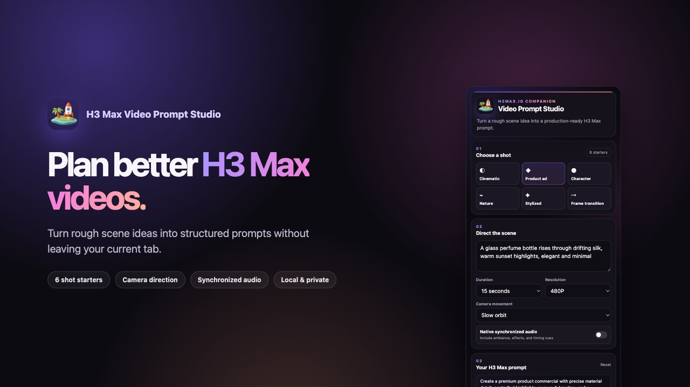

# H3 Max Video Prompt Studio

A lightweight Chrome side panel extension for turning rough video ideas into structured prompts for MiniMax H3 Max.

This repository is maintained by [h3max.io](https://h3max.io), an independent workspace for creating AI videos with MiniMax H3 Max.

## What It Does

H3 Max Video Prompt Studio stays beside your current browser tab while you plan a shot. Choose a practical starter, describe the scene, set the duration, resolution, camera movement, and audio preference, then copy a complete prompt for the H3 Max generation workspace.

The extension includes starters for:

- cinematic reveals
- product commercials
- character-driven shots
- nature and travel scenes
- stylized animation
- first-frame to last-frame transitions

## Preview

## How To Use It

1. Click the extension icon to open the Chrome side panel.
2. Choose the shot type closest to your idea.
3. Add the subject, action, setting, mood, lighting, or other important details.
4. Select a 5, 10, or 15 second duration and 480P or 768P output.
5. Pick a camera movement and decide whether the prompt should include synchronized audio direction.
6. Click **Copy prompt**.
7. Click **Open h3max.io**, paste the prompt into the generation workspace, and add first/last frame images when your workflow needs them.

## Features

- Manifest V3 Chrome side panel
- six reusable H3 Max video prompt starters
- controls for supported duration and resolution choices
- camera and synchronized-audio direction
- local prompt assembly and one-click copy
- direct link to [h3max.io](https://h3max.io)
- automatic local restoration of the latest prompt settings

## Privacy

The extension is intentionally small and private:

- no webpage content is read
- no browsing history or tab URLs are collected
- no host permissions or content scripts are requested
- no prompt text is uploaded
- no analytics, advertising, or remote code is included
- no account is required

The `storage` permission only remembers your latest prompt settings inside Chrome. The `sidePanel` permission allows the prompt studio to appear in Chrome's side panel.

Read the full [privacy policy](docs/privacy-policy.md).

## Install From Source

1. Download or clone this repository.
2. Open `chrome://extensions` in Chrome.
3. Enable **Developer mode**.
4. Click **Load unpacked**.
5. Select this repository folder.
6. Pin the extension if desired, then click its icon to open the side panel.

## Project Structure

- `manifest.json` — Manifest V3 configuration
- `service-worker.js` — opens the side panel from the toolbar icon
- `popup.html`, `popup.css`, `popup.js` — prompt studio interface and behavior
- `assets/icons/` — Chrome extension icons
- `assets/store/` — Chrome Web Store listing artwork
- `docs/` — listing copy, reviewer instructions, privacy policy, and submission checklist

## Development

The project uses plain HTML, CSS, and JavaScript with no build step and no remote dependencies. Load the repository as an unpacked extension after making changes.

Please keep contributions aligned with the extension's single purpose and privacy posture: no unnecessary permissions, content scripts, tracking, or remote executable code.

## License

Released under the [MIT License](LICENSE).

## Maintainer

Maintained by [h3max.io](https://h3max.io). For questions, contact [hi@h3max.io](mailto:hi@h3max.io).
